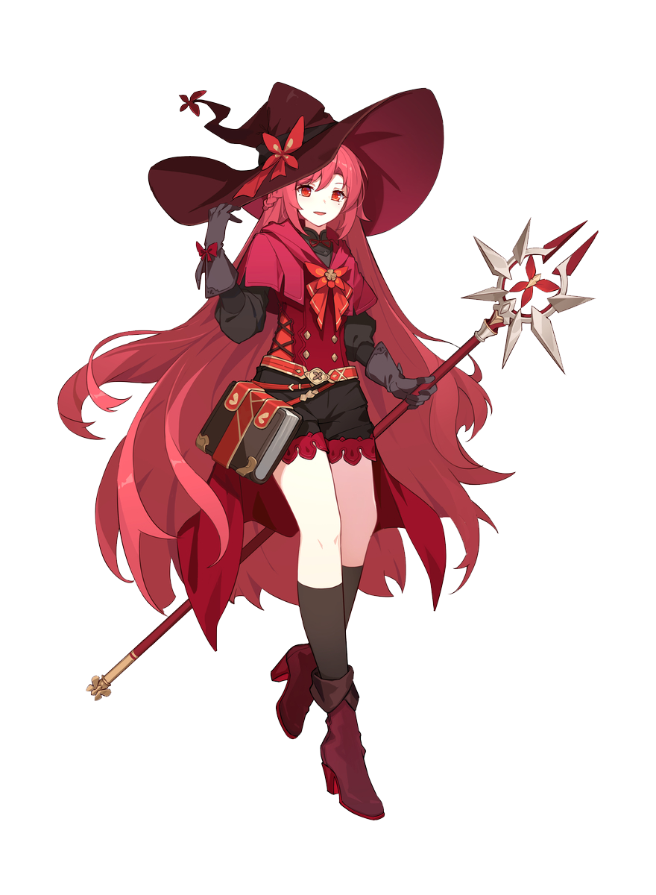

<div align="center">
<!--  -->
<!--  -->

</div>


<a href="https://discord.com/users/980452119670837350"></a>


### Hi!👋 I'm Moon 🍒

**Software Engineer and Gamer** 

## **☕ About me**
I'm a Software Engineer and I breath code. My hobbies are playing games, watching animations, reading books and manga, plus I love cars and going to sports car events. 
<br><br>

## **💻 Experience**

Passionate Java Software Engineer with expertise in advanced Java programming techniques. Skilled in leveraging Java's powerful features to develop efficient and scalable software solutions. Adept in JVM-related languages such as Scala, Clojure, and Kotlin, and continuously improving in functional programming. Seeking challenging opportunities to contribute to innovative projects and further enhance Java proficiency.

Currently pursuing a bachelor's degree in Software Engineering at [FIAP - College of Informatics and Administration from São Paulo, Brazil](https://fiap.com.br/). 


## **📊 Github Stats**
<!-- <div><a href="https://github.com/MiyagawaMizu"></a><div> -->
<p align="center"> 
</p>

## **🎧 Spotify**
<p align="center">

<a href="https://open.spotify.com/user/31h3yfkprcdqred7ek43wtzio6ge"></a>
</p>

## **🧋Visitors**

<a href="https://discord.com/users/980452119670837350"></a>
<a href="https://github.com/moonflairr"></a>

```rust
People who visit my profile have a big space on my heart.

I have room for everyone in my heart.
```
<!-- <br><br><br><br> -->
## **📫 Contact**
<a href="https://github.com/moonflairr"></a>
**Best contact:** [contactmoonflair@pm.me](mail:contactmoonflair@pm.me)

<!-- <a href="https://github.com/Meghna-DAS/github-profile-views-counter"> -->
[](https://github.com/moonflairr)
[](https://discord.com/users/980452119670837350)
[](https://steamcommunity.com/id/moonflair)
[](mailto:contactmoonflair@pm.me)
<!-- [](https://mizu.is-a.dev/) -->